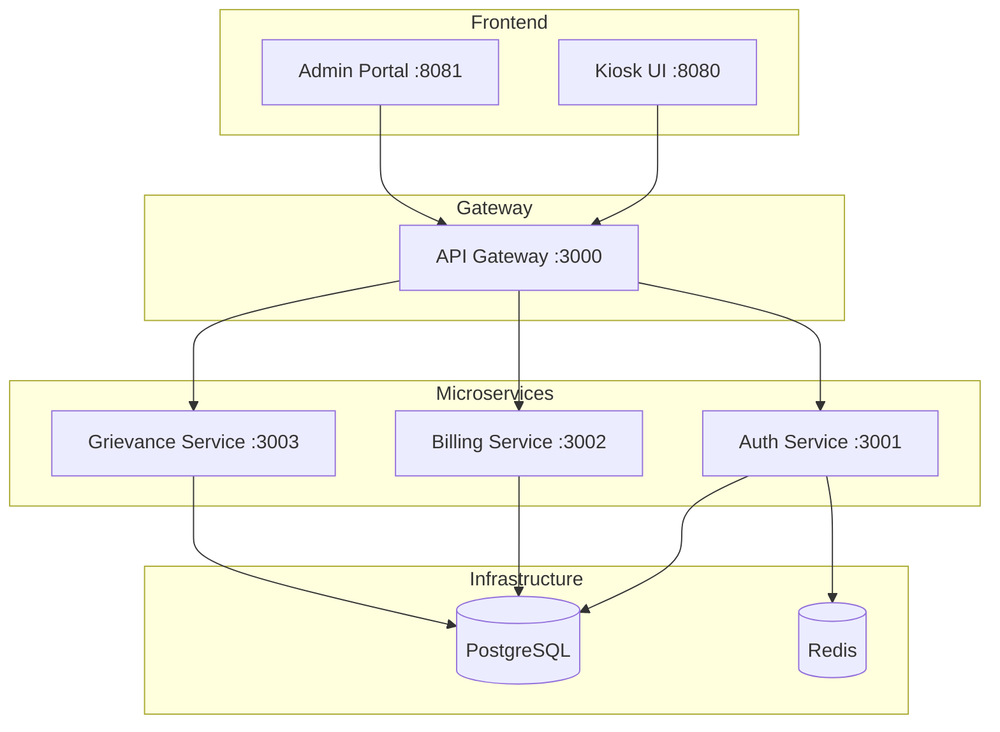

# SUVIDHA 2026

**Smart Urban Virtual Interactive Digital Helpdesk Assistant**

A touch-based, multilingual Self-Service Kiosk interface for civic utility offices (Electricity, Gas, Water, Municipal). Built for the C-DAC SUVIDHA Hackathon Challenge.

---

## 🏗️ Project Structure

```
suvidha2026/
├── apps/
│   ├── kiosk-ui/           # React 19 Touch Kiosk Interface
│   ├── admin-portal/       # React Admin Dashboard
│   └── api-gateway/        # Node.js/Express API Gateway
├── services/
│   ├── auth-service/       # Authentication (OTP/JWT)
│   ├── billing-service/    # Bill Management & Payments
│   └── grievance-service/  # Complaint Tracking
├── packages/
│   └── types/              # Shared TypeScript Definitions
├── infrastructure/
│   └── scripts/            # Database & Deploy Scripts
├── docker-compose.yml      # Production Configuration
├── docker-compose.dev.yml  # Development Overrides
└── PLAN.md                 # Development Roadmap
```

---

## 🚀 Quick Start

### Prerequisites

- Node.js 20+
- Docker & Docker Compose
- Git

### Development Setup

1. **Clone and install dependencies**:
   ```powershell
   git clone <repository-url>
   cd suvidha2026
   
   # Install Kiosk UI
   cd apps/kiosk-ui && npm install && cd ../..
   
   # Install API Gateway
   cd apps/api-gateway && npm install && cd ../..
   ```

2. **Start infrastructure** (PostgreSQL + Redis):
   ```powershell
   docker-compose up postgres redis -d
   ```

3. **Run Kiosk UI** (development):
   ```powershell
   cd apps/kiosk-ui
   npm run dev
   # Opens at http://localhost:5173
   ```

4. **Run API Gateway**:
   ```powershell
   cd apps/api-gateway
   npm run dev
   # Runs at http://localhost:3000
   ```

### Full Stack (Docker)

```powershell
# Build all services
docker-compose build

# Start entire stack
docker-compose up -d

# View logs
docker-compose logs -f
```

| Service | URL |
|---------|-----|
| Kiosk UI | http://localhost:8080 |
| Admin Portal | http://localhost:8081 |
| API Gateway | http://localhost:3000 |
| PostgreSQL | localhost:5432 |
| Redis | localhost:6379 |

---

## 🏛️ Architecture



---

## 🔐 Security Features

- **DPDP Act Compliance**: PII encryption at rest (AES-256)
- **JWT Authentication**: Stateless token-based auth
- **Rate Limiting**: DDoS protection on API Gateway
- **Input Validation**: Zod schema validation on all endpoints
- **Security Headers**: Helmet middleware for XSS/CSRF protection
- **Audit Logging**: All transactions logged for compliance

---

## 📱 Kiosk UI Features

- **Touch-Optimized**: Minimum 48px touch targets (WCAG 2.1 AA)
- **High Contrast**: Accessible color palette
- **Multilingual**: English + Hindi (expandable)
- **Responsive**: Works on various kiosk screen sizes

---

## 📋 Development Phases

See [PLAN.md](./PLAN.md) for detailed roadmap:

1. ✅ **Scaffolding** - Project structure & Docker
2. ⏳ **Core Authentication** - OTP/JWT implementation
3. ⏳ **Billing Module** - Payment integration
4. ⏳ **Grievance System** - Complaint management
5. ⏳ **Multilingual Support** - i18n implementation
6. ⏳ **Admin Dashboard** - Analytics & monitoring
7. ⏳ **Security Hardening** - DPDP compliance
8. ⏳ **Testing & QA** - E2E tests
9. ⏳ **Final Polish** - Production readiness

---

## 🧪 Testing

```powershell
# Unit tests
npm run test

# E2E tests (Kiosk UI)
cd apps/kiosk-ui && npm run test:e2e
```

---

## 📄 License

Developed for C-DAC SUVIDHA Hackathon Challenge 2026.

---

## 🤝 Contributing

1. Follow the development phases in PLAN.md
2. Ensure code passes linting (`npm run lint`)
3. Write tests for new features
4. Update documentation as needed
